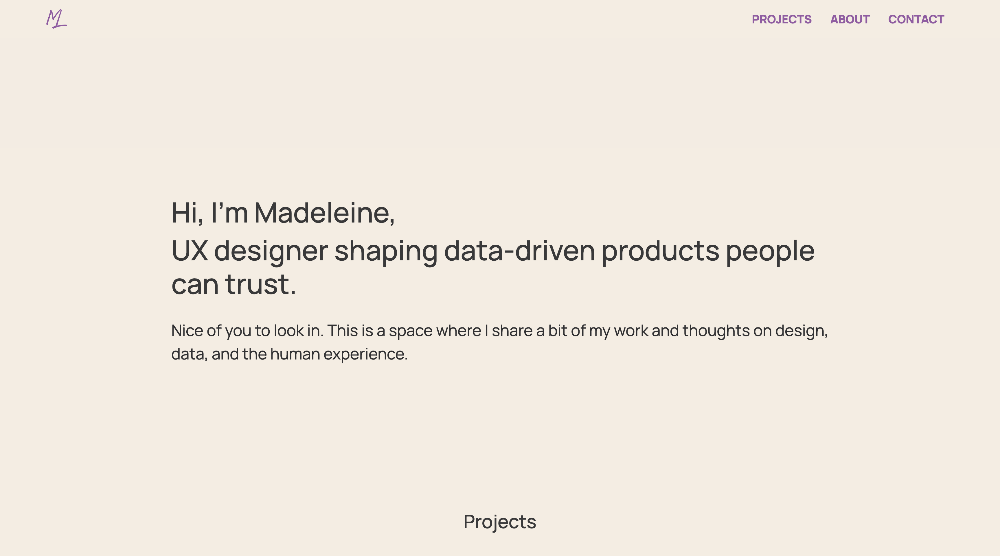

# Portfolio



This is my personal portfolio website — designed and built by me.

It’s a space to present selected work in a way that reflects how I approach product design: creating clarity in complex systems, structuring information, and focusing on calm, usable experiences rather than visual noise.

---

## Live site

[View live site](https://madeleinelexen.github.io/#/)

---

## About the project

I’ve focused on structuring complex work so it’s easier to understand and move through.

Key focuses in this project:

- Structuring case studies so they are both scannable and meaningful  
- Balancing storytelling with clarity  
- Reducing unnecessary visual and interaction noise  
- Creating a calm reading experience through spacing, rhythm, and hierarchy  

The goal is not to impress through effects, but to make the content easy to engage with.

---

## Key decisions

- **Landing + projects in one flow**  
  Projects are accessible directly from the landing page to reduce friction and make exploration immediate.

- **Minimal navigation**  
Keeps the structure predictable and avoids pulling attention away from the content.

- **Smooth scrolling instead of hard transitions**  
  Keeps the experience continuous and avoids breaking the reading flow.

- **Limited use of animations**  
  Interactions are subtle and supportive, not attention-grabbing.

---

## Future improvements
- Expand with more case studies
- Refine mobile reading experience
- Continue iterating on structure and clarity as content grows

---

## Tech stack

- React / Next.js  
- TypeScript  
- CSS (custom styling)  

The site is coded by me, with occasional support from AI tools (e.g. GitHub Copilot) as a development aid.

---

## Running locally

```bash
npm install
npm run dev